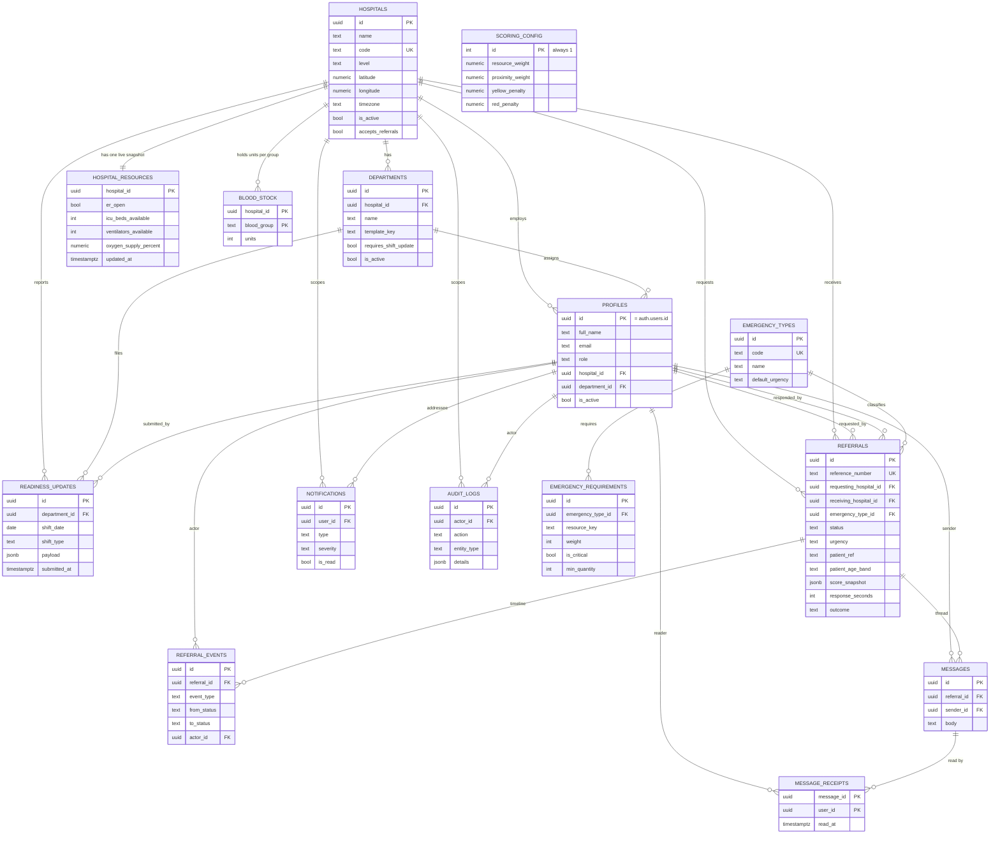

# FERN — Data Model

The authoritative schema is `supabase/migrations/0001_schema.sql`, with security in
`0002_rls.sql`. `src/lib/database.types.ts` is a hand-maintained TypeScript mirror of it, and
`src/lib/constants.ts` holds the enumerated value sets that the `CHECK` constraints below repeat.
All three must move together; this document describes what they currently say.

Fifteen application tables, one view, and one internal table no client can touch.

**Conventions across the schema**

- Primary keys are `uuid`, defaulted with `gen_random_uuid()` from `pgcrypto`.
- Timestamps are `timestamptz`, stored in UTC. Local shift arithmetic uses each hospital's own
  `timezone` column, never the server's or the viewer's.
- `created_at` defaults to `now()`. Where a table has `updated_at`, a `set_updated_at()` trigger
  maintains it — the application never sets it by hand.
- Enumerated columns are `text` with a `CHECK` constraint rather than a Postgres `enum` type.
  Adding a value to an `enum` requires an `ALTER TYPE` that cannot run inside every transaction;
  a `CHECK` is a one-line migration, and the constraint list is verifiable against `constants.ts`
  by eye.
- Row-level security is enabled on **every** table. Default privileges are revoked from `anon` and
  `authenticated` before explicit grants are issued, so a table with a missing policy fails closed.

---

## Entity relationships

---

## 1. `hospitals`

The facility register. Every other table is scoped by it, directly or transitively.

| Column | Type | Null | Default | Meaning |
| --- | --- | :---: | --- | --- |
| `id` | `uuid` | no | `gen_random_uuid()` | Primary key |
| `name` | `text` | no | — | Facility name. Must not be blank |
| `code` | `text` | no | — | Short unique identifier, e.g. `KBTH`. Shown on referral forms |
| `level` | `text` | no | `'district'` | Care tier — see enumerations |
| `address` | `text` | yes | — | Street address |
| `city` | `text` | yes | — | Town or city |
| `region` | `text` | yes | — | Administrative region; a filter on the hospital directory |
| `country` | `text` | no | `'Ghana'` | Country |
| `latitude` | `numeric(9,6)` | no | — | Decimal degrees, −90…90. **Drives 30% of every score** |
| `longitude` | `numeric(9,6)` | no | — | Decimal degrees, −180…180 |
| `phone` | `text` | yes | — | Switchboard. Rendered as a `tel:` link |
| `emergency_phone` | `text` | yes | — | Direct emergency line, shown first on a referral |
| `email` | `text` | yes | — | Referrals mailbox |
| `timezone` | `text` | no | `'Africa/Accra'` | IANA zone. All shift arithmetic for this facility uses it |
| `is_active` | `boolean` | no | `true` | Deactivate rather than delete; referral history must keep resolving |
| `accepts_referrals` | `boolean` | no | `true` | A standing "do not send" flag, distinct from the shift-by-shift diversion flag |
| `notes` | `text` | yes | — | Free-text operational notes |
| `created_at` | `timestamptz` | no | `now()` | |
| `updated_at` | `timestamptz` | no | `now()` | Trigger-maintained |

**Constraints** — `code` unique; `name` and `code` non-blank; latitude and longitude bounded;
`level` restricted to the six tiers.

**Six decimal places** on the coordinates is roughly 0.1 m of precision. That is far finer than the
ranking needs, but it costs nothing and it removes any question about rounding when a facility sits
close to a search-radius boundary.

---

## 2. `departments`

Units within a hospital. The `template_key` decides which resource fields the department's readiness
form presents and is responsible for.

| Column | Type | Null | Default | Meaning |
| --- | --- | :---: | --- | --- |
| `id` | `uuid` | no | `gen_random_uuid()` | Primary key |
| `hospital_id` | `uuid` | no | — | → `hospitals.id`, `on delete cascade` |
| `name` | `text` | no | — | Local name, e.g. "Adult ICU". Unique within the hospital |
| `template_key` | `text` | no | — | One of twelve templates — see enumerations |
| `contact_phone` | `text` | yes | — | Direct line to the unit |
| `requires_shift_update` | `boolean` | no | `true` | When false the unit is excluded from the traffic-light roll-up and from compliance. Use for administrative units that hold no resources |
| `is_active` | `boolean` | no | `true` | Inactive departments drop out of the `department_readiness` view |
| `created_at` / `updated_at` | `timestamptz` | no | `now()` | |

**Constraints** — unique `(hospital_id, name)`; `template_key` restricted to the twelve keys.

---

## 3. `profiles`

One row per authenticated user. `id` **is** the `auth.users` id, so the application never stores a
second identity. Created automatically by the `handle_new_auth_user` trigger on `auth.users`, which
reads role, hospital and department from the invitation's **app** metadata (service-role writable
only, never `user_metadata`) and falls back to `viewer`
with no hospital when the metadata is missing or malformed.

| Column | Type | Null | Default | Meaning |
| --- | --- | :---: | --- | --- |
| `id` | `uuid` | no | — | PK and FK → `auth.users.id`, `on delete cascade` |
| `full_name` | `text` | no | `''` | Display name, shown on timelines and chat |
| `email` | `text` | no | `''` | Copied from the auth record for display and audit |
| `phone` | `text` | yes | — | Work contact |
| `role` | `text` | no | `'viewer'` | One of five roles. **Changing it is trigger-guarded** |
| `hospital_id` | `uuid` | yes | — | → `hospitals.id`, `on delete set null`. Null only for `super_admin`; every other role needs one or scoped policies return nothing |
| `department_id` | `uuid` | yes | — | → `departments.id`. Steers which readiness form the user lands on. Deliberately self-editable — it grants nothing |
| `is_active` | `boolean` | no | `true` | **False revokes all access instantly**: `current_user_role()` and `current_user_hospital()` filter on it, so a live JWT resolves to no role and every scoped policy fails closed |
| `must_change_password` | `boolean` | no | `false` | Set when an admin issues a credential; cleared when the user sets their own |
| `last_login_at` | `timestamptz` | yes | — | Stamped by `record_login()` |
| `created_at` / `updated_at` | `timestamptz` | no | `now()` | |

**Constraints** — `role` restricted to the five roles.

**Security notes.** There is no INSERT policy (only the auth trigger creates profiles) and no DELETE
policy (deactivate, never delete, so the audit trail keeps pointing at a real person). The
`guard_profile_privileges` `BEFORE UPDATE` trigger rejects any change to `role`, `hospital_id` or
`is_active` unless the caller is a `super_admin`, or a `hospital_admin` acting within their own
hospital on a non-super-admin role. A `WITH CHECK` clause cannot see the old row, which is precisely
why this has to be a trigger.

---

## 4. `hospital_resources`

One row per hospital holding the current value of all 22 tracked resources. This is the table the
ranking engine reads; `readiness_updates` is the history behind it. `submit_readiness()` keeps the
two in step inside one transaction.

`hospital_id` is the primary key — one live snapshot per hospital, by construction.

| Column | Type | Null | Default | Resource key | Meaning |
| --- | --- | :---: | --- | --- | --- |
| `hospital_id` | `uuid` | no | — | — | PK, FK → `hospitals.id`, cascade |
| `er_open` | `boolean` | no | `true` | — | False = on diversion. Set by the Emergency department's form |
| `diversion_reason` | `text` | yes | — | — | Shown on candidate cards when `er_open` is false |
| `operating_rooms_total` | `integer` | no | `0` | — | Theatre capacity |
| `operating_rooms_functional` | `integer` | no | `0` | `operating_room` | Theatres working **and free this shift**. Saturates at 1 |
| `resident_surgeon_available` | `boolean` | no | `false` | `resident_surgeon` | A surgeon physically present and able to operate |
| `anesthetist_available` | `boolean` | no | `false` | `anesthetist` | |
| `obstetric_theatre_available` | `boolean` | no | `false` | `obstetric_theatre` | |
| `neurosurgery_available` | `boolean` | no | `false` | `neurosurgery` | |
| `cath_lab_available` | `boolean` | no | `false` | `cath_lab` | |
| `icu_beds_total` | `integer` | no | `0` | — | ICU capacity |
| `icu_beds_available` | `integer` | no | `0` | `icu_bed` | Free ICU beds. Saturates at 2 |
| `nicu_beds_total` | `integer` | no | `0` | — | NICU capacity |
| `nicu_beds_available` | `integer` | no | `0` | `nicu_bed` | Free cots. Saturates at 2 |
| `neonatal_resuscitation_available` | `boolean` | no | `false` | `neonatal_resuscitation` | |
| `ventilators_total` | `integer` | no | `0` | — | Ventilator capacity |
| `ventilators_available` | `integer` | no | `0` | `ventilator` | Free ventilators. Saturates at 2 |
| `oxygen_supply_percent` | `numeric(5,2)` | no | `0` | `oxygen` | 0–100% of normal working stock, cylinders plus plant |
| `isolation_beds_available` | `integer` | no | `0` | `isolation_bed` | Saturates at 1 |
| `general_beds_total` | `integer` | no | `0` | — | Ward capacity |
| `general_beds_available` | `integer` | no | `0` | `general_bed` | Saturates at 5 |
| `burn_unit_available` | `boolean` | no | `false` | `burn_unit` | Burns unit able to admit |
| `dialysis_available` | `boolean` | no | `false` | `dialysis` | |
| `blood_bank_functional` | `boolean` | no | `false` | `blood_bank` | Per-group counts live in `blood_stock` |
| `ct_functional` | `boolean` | no | `false` | `ct_scan` | |
| `mri_functional` | `boolean` | no | `false` | `mri` | |
| `xray_functional` | `boolean` | no | `false` | `xray` | |
| `ultrasound_functional` | `boolean` | no | `false` | `ultrasound` | |
| `ambulances_available` | `integer` | no | `0` | `ambulance` | Saturates at 1 |
| `power_backup_available` | `boolean` | no | `false` | `power_backup` | |
| `updated_at` | `timestamptz` | no | `now()` | — | Freshness fallback when a hospital has no departments |
| `updated_by` | `uuid` | yes | — | — | → `profiles.id`, `on delete set null` |

**Constraints** — every count `>= 0`; oxygen between 0 and 100; and five capacity constraints:
functional theatres ≤ total, and available ≤ total for ICU, NICU, ventilators and general beds. Those
five are what stop "8 of 4 ICU beds free" from ever reaching a coordinator's screen.

**Saturation** is a scoring concept, not a stored one — the quantities above come from
`RESOURCES[key].saturationQuantity` in `constants.ts` and are listed here because they explain why
one free ICU bed scores 0.5 rather than 1.0. See [SPECIFICATION.md](SPECIFICATION.md) section 4.2.

---

## 5. `blood_stock`

Units held per hospital per blood group. Composite primary key `(hospital_id, blood_group)`.

| Column | Type | Null | Default | Meaning |
| --- | --- | :---: | --- | --- |
| `hospital_id` | `uuid` | no | — | PK part, FK → `hospitals.id`, cascade |
| `blood_group` | `text` | no | — | PK part. One of the eight ABO/Rh groups |
| `units` | `integer` | no | `0` | Units currently held, `>= 0` |
| `updated_at` | `timestamptz` | no | `now()` | Trigger-maintained |
| `updated_by` | `uuid` | yes | — | → `profiles.id` |

Only a department whose template sets `collectsBloodStock` submits these. The scorer uses the
boolean `blood_bank_functional` for ranking and surfaces the per-group counts to the coordinator as
context — a decision about a specific group is a clinical judgement, not an arithmetic one.

---

## 6. `readiness_updates`

The append-only shift log. One row per department per shift; this is the history from which the
traffic light and all compliance reporting are computed.

| Column | Type | Null | Default | Meaning |
| --- | --- | :---: | --- | --- |
| `id` | `uuid` | no | `gen_random_uuid()` | Primary key |
| `hospital_id` | `uuid` | no | — | → `hospitals.id`, cascade. Denormalised so hospital-scoped queries need no join |
| `department_id` | `uuid` | no | — | → `departments.id`, cascade |
| `shift_date` | `date` | no | — | Date the shift **started**, in the hospital's timezone |
| `shift_type` | `text` | no | — | `morning` \| `afternoon` \| `night` |
| `submitted_by` | `uuid` | yes | — | → `profiles.id`, `on delete set null` |
| `submitted_at` | `timestamptz` | no | `now()` | When it was actually filed |
| `payload` | `jsonb` | no | `'{}'` | The submitted `ReadinessPayload`: resource values, optional blood stock, optional ER status |
| `notes` | `text` | yes | — | Handover note |

**Constraints** — unique `(department_id, shift_date, shift_type)`, which is what makes a second
submission in the same shift a correction rather than a duplicate; `shift_type` restricted to three
values.

**No UPDATE or DELETE policy exists.** A new shift is a new row, and a correction to the current
shift goes through `submit_readiness()`'s upsert. The log cannot be rewritten from a client.

**Why `payload` is JSON.** Each department reports a different subset of the 22 resources. A JSON
payload keeps the history in the shape it was submitted, so adding a resource to a template later
does not require a schema migration or backfill of rows that never had that field. The *current*
values are separately materialised into `hospital_resources` for fast, indexable reads.

---

## 7. `emergency_types`

The catalogue of presentations a coordinator can choose from.

| Column | Type | Null | Default | Meaning |
| --- | --- | :---: | --- | --- |
| `id` | `uuid` | no | `gen_random_uuid()` | Primary key |
| `code` | `text` | no | — | Unique short code, e.g. `RTA_TRAUMA` |
| `name` | `text` | no | — | Display name |
| `category` | `text` | no | — | Grouping for the picker, e.g. Trauma, Obstetric, Paediatric |
| `description` | `text` | yes | — | Guidance shown under the option |
| `default_urgency` | `text` | no | `'urgent'` | Pre-selected urgency |
| `sort_order` | `integer` | no | `0` | Display order; ties break on name |
| `is_active` | `boolean` | no | `true` | Retire a type without deleting it — referrals reference it |
| `created_at` | `timestamptz` | no | `now()` | |

---

## 8. `emergency_requirements`

What each emergency type needs, and how much it matters. These rows are the input to the resource
sub-score.

| Column | Type | Null | Default | Meaning |
| --- | --- | :---: | --- | --- |
| `id` | `uuid` | no | `gen_random_uuid()` | Primary key |
| `emergency_type_id` | `uuid` | no | — | → `emergency_types.id`, cascade |
| `resource_key` | `text` | no | — | One of the 22 resource keys |
| `weight` | `integer` | no | `1` | 0–10. Relative importance within this emergency type |
| `is_critical` | `boolean` | no | `false` | **A hospital that does not meet this is excluded outright**, not merely scored down. Use sparingly |
| `min_quantity` | `integer` | no | `0` | Threshold for "actually present" — units for a count, percent for a percentage |

**Constraints** — unique `(emergency_type_id, resource_key)`; `weight` between 0 and 10;
`min_quantity >= 0`; `resource_key` restricted to the 22 keys.

A weight of 0 on a non-critical requirement drops the row from scoring entirely. If an emergency
type has no requirements at all, `FALLBACK_REQUIREMENTS` applies — general bed (w3), oxygen ≥20%
(w2), power backup (w1) — so a misconfigured catalogue degrades to "can this place take a patient at
all?" rather than scoring every hospital identically at zero.

---

## 9. `referrals`

The central record. Note what is **not** here: no patient name, date of birth, national ID, hospital
number, address or next of kin. There is no column into which one could be smuggled, and none must
ever be added. See [SECURITY.md](SECURITY.md) section 8.

| Column | Type | Null | Default | Meaning |
| --- | --- | :---: | --- | --- |
| `id` | `uuid` | no | `gen_random_uuid()` | Primary key |
| `reference_number` | `text` | no | trigger | `FERN-YYYYMMDD-NNNN`, unique. Assigned by `assign_referral_reference()` |
| `requesting_hospital_id` | `uuid` | no | — | → `hospitals.id`, `on delete restrict`. Set from the caller's profile, never from a client argument |
| `receiving_hospital_id` | `uuid` | yes | — | → `hospitals.id`, `on delete set null` |
| `emergency_type_id` | `uuid` | no | — | → `emergency_types.id`, `on delete restrict` |
| `urgency` | `text` | no | `'urgent'` | `critical` \| `urgent` \| `routine`. Also selects the assumed transport speed |
| `status` | `text` | no | `'pending'` | The lifecycle state — see enumerations |
| `patient_ref` | `text` | no | — | Generated non-identifying code, e.g. `PT-7K3QF2` |
| `patient_age_band` | `text` | no | — | One of six bands. Never a date of birth |
| `patient_sex` | `text` | no | `'undisclosed'` | `female` \| `male` \| `other` \| `undisclosed` |
| `clinical_summary` | `text` | no | — | Presentation and stability, **≤ 1000 characters** |
| `required_resources` | `text[]` | no | `'{}'` | Must-haves ticked by the coordinator; constrained to known resource keys |
| `score_snapshot` | `jsonb` | no | `'{}'` | Configuration, normalised requirements and the selected hospital's full breakdown at decision time |
| `candidate_snapshot` | `jsonb` | no | `'{}'` | The top ten alternatives with scores and exclusion reasons |
| `distance_km` | `numeric(8,2)` | yes | — | Straight-line distance at decision time |
| `eta_minutes` | `numeric(8,2)` | yes | — | Estimated transport time at decision time |
| `requested_by` | `uuid` | yes | — | → `profiles.id`, `on delete set null` |
| `requested_at` | `timestamptz` | no | `now()` | |
| `responded_by` | `uuid` | yes | — | Who accepted or declined |
| `responded_at` | `timestamptz` | yes | — | First response |
| `response_seconds` | `integer` | yes | — | Request → first response. Materialised because every report uses it |
| `accepted_at` | `timestamptz` | yes | — | |
| `in_transit_at` | `timestamptz` | yes | — | |
| `completed_at` | `timestamptz` | yes | — | |
| `cancelled_at` | `timestamptz` | yes | — | |
| `decline_reason` | `text` | yes | — | Visible to the referring hospital |
| `outcome` | `text` | yes | — | One of six outcomes; required on completion |
| `outcome_notes` | `text` | yes | — | |
| `created_at` / `updated_at` | `timestamptz` | no | `now()` | |

**Constraints** — `reference_number` unique; every enumerated column checked;
`length(clinical_summary) <= 1000`; `required_resources <@` the known key array;
`response_seconds >= 0`; `referrals_not_self` — a hospital cannot refer to itself.

**Why the snapshots exist.** Readiness data changes every eight hours. Without a snapshot, a
governance review six months later could not reconstruct why a hospital was chosen. With it, the
whole decision — configuration, weights, per-resource availability, the alternatives and why each
was excluded — is preserved as it stood.

**Why the reference number needs a counter table.** Deriving `NNNN` from `count(*)` races under
concurrent inserts. `referral_reference_counters` holds one row per date and the
`on conflict do update … returning` takes a row lock, which serialises same-day inserts and hands
each one a distinct value.

**No INSERT or UPDATE policy.** `create_referral()` and `update_referral_status()` are the only
writers, because a referral is never just a row — it comes with a snapshot, a timeline event, a
notification and an audit entry, and its status must obey a state machine.

---

## 10. `referral_events`

The immutable timeline. Append-only, readable by both participating hospitals, and shown in the UI
without needing the `audit:view` capability.

| Column | Type | Null | Default | Meaning |
| --- | --- | :---: | --- | --- |
| `id` | `uuid` | no | `gen_random_uuid()` | Primary key |
| `referral_id` | `uuid` | no | — | → `referrals.id`, cascade |
| `event_type` | `text` | no | — | `created`, `status_change`, `note`, … Unconstrained, so the vocabulary can grow |
| `from_status` | `text` | yes | — | Previous status, checked against the seven values |
| `to_status` | `text` | yes | — | New status |
| `actor_id` | `uuid` | yes | — | → `profiles.id`, `on delete set null` |
| `actor_hospital_id` | `uuid` | yes | — | Which side acted |
| `notes` | `text` | yes | — | Decline reason or handover note |
| `created_at` | `timestamptz` | no | `now()` | |

---

## 11. `messages`

Chat between the two hospitals on a referral.

| Column | Type | Null | Default | Meaning |
| --- | --- | :---: | --- | --- |
| `id` | `uuid` | no | `gen_random_uuid()` | Primary key |
| `referral_id` | `uuid` | no | — | → `referrals.id`, cascade |
| `sender_id` | `uuid` | yes | — | → `profiles.id`, `on delete set null` |
| `sender_hospital_id` | `uuid` | yes | — | Which side sent it |
| `body` | `text` | no | — | 1–4000 characters, non-blank |
| `created_at` | `timestamptz` | no | `now()` | |

**Insert is permitted only** when the caller holds `messaging:use`, `sender_id = auth.uid()`,
`sender_hospital_id` matches their own hospital, and the referral is `pending`, `accepted` or
`in_transit`. A closed referral is a record, not a conversation.

### `message_receipts`

| Column | Type | Null | Default | Meaning |
| --- | --- | :---: | --- | --- |
| `message_id` | `uuid` | no | — | PK part, → `messages.id`, cascade |
| `user_id` | `uuid` | no | — | PK part, → `profiles.id`, cascade |
| `read_at` | `timestamptz` | no | `now()` | |

Visible only to the reader themselves.

---

## 12. `notifications`

Per-user in-app alerts. Written only by the RPCs — the referral fan-out and
`flag_overdue_readiness()`.

| Column | Type | Null | Default | Meaning |
| --- | --- | :---: | --- | --- |
| `id` | `uuid` | no | `gen_random_uuid()` | Primary key |
| `user_id` | `uuid` | no | — | → `profiles.id`, cascade. The addressee |
| `hospital_id` | `uuid` | yes | — | → `hospitals.id`, cascade. Context |
| `type` | `text` | no | — | One of nine types — see enumerations |
| `title` | `text` | no | — | One-line headline |
| `body` | `text` | yes | — | Detail |
| `link` | `text` | yes | — | In-app path, e.g. `/referrals/<id>` |
| `severity` | `text` | no | `'info'` | `info` \| `warning` \| `critical`. Yellow readiness → warning, red → critical |
| `is_read` | `boolean` | no | `false` | |
| `read_at` | `timestamptz` | yes | — | |
| `created_at` | `timestamptz` | no | `now()` | |

A user can only ever see and update their own rows — `user_id = auth.uid()` on both policies.

---

## 13. `audit_logs`

The append-only security and activity trail. There is a `SELECT` policy and no INSERT, UPDATE or
DELETE policy at all: `log_audit_event()` is the only writer, and no client role can alter a row.

| Column | Type | Null | Default | Meaning |
| --- | --- | :---: | --- | --- |
| `id` | `uuid` | no | `gen_random_uuid()` | Primary key |
| `actor_id` | `uuid` | yes | — | → `profiles.id`, `on delete set null` |
| `actor_email` | `text` | yes | — | Denormalised at write time |
| `actor_role` | `text` | yes | — | Denormalised at write time |
| `hospital_id` | `uuid` | yes | — | Scopes `hospital_admin` visibility |
| `action` | `text` | no | — | e.g. `referral.accept`. **Deliberately unconstrained** |
| `entity_type` | `text` | yes | — | `referral`, `department`, `hospital`, `report`, … |
| `entity_id` | `uuid` | yes | — | The affected row |
| `details` | `jsonb` | no | `'{}'` | Context. Never a password, token or clinical summary |
| `created_at` | `timestamptz` | no | `now()` | |

**Why actor email and role are denormalised.** An audit row must still make sense after a person
changes role, moves hospital or leaves. Joining to the live profile would rewrite history.

**Why `action` has no `CHECK`.** The catalogue in `constants.ts` will grow, and an audit row must
never be the thing that fails a clinical transaction.

---

## 14. `scoring_config`

Exactly one row, `id = 1`, enforced by `check (id = 1)`. It mirrors `DEFAULT_SCORING_CONFIG` in
`constants.ts` and is seeded by the migration.

| Column | Type | Null | Default | Meaning |
| --- | --- | :---: | --- | --- |
| `id` | `integer` | no | `1` | Always 1 |
| `resource_weight` | `numeric(4,3)` | no | `0.700` | Weight on the resource sub-score |
| `proximity_weight` | `numeric(4,3)` | no | `0.300` | Weight on the proximity sub-score |
| `yellow_penalty` | `numeric(4,3)` | no | `0.150` | Multiplicative penalty for yellow readiness |
| `red_penalty` | `numeric(4,3)` | no | `0.350` | Multiplicative penalty for red readiness |
| `max_eta_minutes` | `integer` | no | `180` | ETA at which proximity scores zero |
| `max_distance_km` | `numeric(8,2)` | no | `250` | Search radius |
| `road_distance_factor` | `numeric(4,2)` | no | `1.30` | Great-circle km × this ≈ road km |
| `fixed_transport_overhead_minutes` | `integer` | no | `10` | Dispatch and handover |
| `tie_break_epsilon` | `numeric(5,2)` | no | `0.50` | Scores within this many points count as tied |
| `exclude_red_hospitals` | `boolean` | no | `false` | Hard-exclude stale hospitals |
| `exclude_hospitals_on_diversion` | `boolean` | no | `true` | Never recommend a hospital on diversion |
| `updated_at` | `timestamptz` | no | `now()` | |
| `updated_by` | `uuid` | yes | — | → `profiles.id` |

Readable by every authenticated user; updatable by `super_admin` only. Changes take effect on the
next ranking with no redeploy, and are recorded in `audit_logs` under `config.update` — which is
where the previous values are found if one needs reverting.

---

## 15. `department_readiness` (view)

The freshest submission per active department, plus the submitter's name.

| Column | Source |
| --- | --- |
| `department_id`, `hospital_id`, `department_name`, `template_key`, `requires_shift_update` | `departments` |
| `last_submitted_at`, `last_shift_date`, `last_shift_type`, `last_submitted_by` | The latest `readiness_updates` row, via a `LATERAL` join |
| `last_submitted_by_name` | `profiles.full_name` |

Two decisions in this view matter:

- **`security_invoker = true`.** The view is filtered by the *caller's* policies, not the view
  owner's, so a hospital cannot read a colleague's name out of another facility through it.
- **Ordering by the shift described, not the submission time.** The lateral join orders by
  `shift_date desc`, then night > afternoon > morning, then `submitted_at desc`. A late correction
  filed for an old shift must not masquerade as the current state.

The traffic-light status itself is **not** in the view — it is derived client-side by
`src/domain/readiness.ts` from `last_submitted_at` and the hospital's timezone, because "now"
differs per viewer and a materialised status would be stale the moment it was written.

---

## 16. `referral_reference_counters` (internal)

| Column | Type | Meaning |
| --- | --- | --- |
| `counter_date` | `date` | Primary key, in the requesting hospital's timezone |
| `last_value` | `integer` | Last sequence number issued that day |

Plumbing for `assign_referral_reference()`. RLS is enabled and **no policies exist**; every
privilege is revoked from `anon` and `authenticated`. No client ever reads it.

---

## Indexes

Every index below is there because a query the application actually issues needs it. There are no
speculative indexes: each one costs write throughput on a table that is written every shift.

| Table | Index | Why |
| --- | --- | --- |
| `hospitals` | `(is_active)` | The directory and candidate search filter on it first |
| `hospitals` | `(region)` | Region filter on the hospital directory |
| `hospitals` | `(latitude, longitude)` | Candidate search bounds a box on the coordinate pair before the haversine expression runs — a plain composite btree earns its keep without pulling in PostGIS |
| `departments` | `(hospital_id)` | Every readiness screen is scoped to one hospital |
| `departments` | `(template_key)` | Grouping departments by type in admin and reporting |
| `profiles` | `(hospital_id)` | Staff lists, and the notification fan-out to a hospital's admins |
| `profiles` | `(department_id)` | Resolving which form a shift in-charge lands on |
| `profiles` | `(role)` | Finding every `hospital_admin` when raising an overdue alert |
| `hospital_resources` | `(updated_by)` | Attribution lookups; keeps the FK cascade cheap |
| `blood_stock` | `(updated_by)` | As above |
| `readiness_updates` | `(hospital_id)` | Hospital-wide compliance queries |
| `readiness_updates` | `(department_id, shift_date desc)` | **The most important index in the schema.** It serves the `department_readiness` lateral join, the history view and every compliance calculation |
| `readiness_updates` | `(submitted_by)` | Per-user activity |
| `readiness_updates` | `(submitted_at desc)` | Recent-activity feeds |
| `emergency_types` | `(sort_order, name)` | The picker's display order, straight from the index |
| `emergency_requirements` | `(emergency_type_id)` | Loading one emergency type's requirement set |
| `referrals` | `(receiving_hospital_id, status)` | The inbox, and the `head`-only pending badge that polls every 30 s |
| `referrals` | `(requesting_hospital_id, status)` | The outbox |
| `referrals` | `(requested_at desc)` | Default ordering on every referral list |
| `referrals` | `(emergency_type_id)` | Analytics grouped by emergency type |
| `referrals` | `(requested_by)`, `(responded_by)` | Per-user activity and cheap FK cascades |
| `referral_events` | `(referral_id, created_at)` | Renders a timeline in one ordered index scan |
| `referral_events` | `(actor_id)` | Per-user activity |
| `messages` | `(referral_id, created_at)` | The chat thread, in order, in one scan |
| `messages` | `(sender_id)` | Attribution |
| `message_receipts` | `(user_id)` | "What have I read" |
| `notifications` | `(user_id, is_read)` | The unread-count badge on every screen. A composite on exactly the two filtered columns turns it into an index-only count |
| `notifications` | `(created_at desc)` | Newest-first listing |
| `notifications` | `(hospital_id)` | Hospital-scoped cleanup and reporting |
| `audit_logs` | `(created_at desc)` | The default newest-first audit view |
| `audit_logs` | `(actor_id)`, `(hospital_id)`, `(action)` | The three filters the audit viewer offers |

Primary keys and unique constraints add their own indexes and are not repeated here — notably
`referrals.reference_number`, `hospitals.code`, `emergency_types.code`,
`readiness_updates (department_id, shift_date, shift_type)` and `departments (hospital_id, name)`.

---

## Enumerated value sets

Every list below is a `CHECK` constraint in `0001_schema.sql` and a `const` array in
`src/lib/constants.ts`. They must be changed together, in one migration and one commit.

**Roles** (`profiles.role`) — `super_admin`, `hospital_admin`, `shift_in_charge`,
`referral_coordinator`, `viewer`

**Hospital levels** (`hospitals.level`) — `health_centre`, `primary`, `district`, `secondary`,
`tertiary`, `specialist`

**Department templates** (`departments.template_key`) — `emergency`, `theatre`, `icu`, `nicu`,
`maternity`, `surgery`, `radiology`, `blood_bank`, `renal`, `cardiology`, `burns`, `general`

**Shift types** (`readiness_updates.shift_type`) — `morning` (07:00–15:00), `afternoon`
(15:00–23:00), `night` (23:00–07:00, attributed to the date it started)

**Readiness statuses** — `green`, `yellow`, `red`. Derived, never stored

**Resource keys** (`emergency_requirements.resource_key`, `referrals.required_resources`) — 22
values: `operating_room`, `resident_surgeon`, `anesthetist`, `obstetric_theatre`, `neurosurgery`,
`cath_lab`, `icu_bed`, `nicu_bed`, `neonatal_resuscitation`, `ventilator`, `oxygen`,
`isolation_bed`, `general_bed`, `burn_unit`, `dialysis`, `blood_bank`, `ct_scan`, `mri`, `xray`,
`ultrasound`, `ambulance`, `power_backup`

**Blood groups** (`blood_stock.blood_group`) — `O-`, `O+`, `A-`, `A+`, `B-`, `B+`, `AB-`, `AB+`

**Referral statuses** (`referrals.status`, `referral_events.from_status` / `to_status`) — `pending`,
`accepted`, `declined`, `in_transit`, `completed`, `cancelled`, `expired`. The first three of these
plus `in_transit` are the "active" set the UI treats as still needing somebody to act

**Urgency levels** (`referrals.urgency`, `emergency_types.default_urgency`) — `critical` (60 km/h
assumed), `urgent` (50 km/h), `routine` (40 km/h)

**Age bands** (`referrals.patient_age_band`) — `neonate` (0–28 days), `infant` (1–12 months),
`child` (1–11 years), `adolescent` (12–17), `adult` (18–64), `older_adult` (65+)

**Patient sex** (`referrals.patient_sex`) — `female`, `male`, `other`, `undisclosed`

**Referral outcomes** (`referrals.outcome`) — `transferred`, `stabilised_on_site`,
`referred_elsewhere`, `died_before_transfer`, `declined_by_patient`, `other`

**Notification types** (`notifications.type`) — `readiness_overdue`, `referral_incoming`,
`referral_accepted`, `referral_declined`, `referral_in_transit`, `referral_completed`,
`referral_cancelled`, `message_received`, `system`

**Notification severity** (`notifications.severity`) — `info`, `warning`, `critical`

**Audit actions** (`audit_logs.action`) — not constrained in SQL, but the catalogue is
`auth.login`, `auth.logout`, `auth.failed_login`, `readiness.submit`, `referral.create`,
`referral.accept`, `referral.decline`, `referral.in_transit`, `referral.complete`,
`referral.cancel`, `message.send`, `hospital.create`, `hospital.update`, `department.create`,
`department.update`, `user.invite`, `user.update_role`, `user.deactivate`, `config.update`,
`report.export`

---

## Growth and retention

### Expected growth

For a network of 20 hospitals averaging 6 reporting departments each:

| Table | Rate | Per year |
| --- | --- | --- |
| `readiness_updates` | 120 departments × 3 shifts/day | ~131,000 rows |
| `referrals` | at 20 referrals/day network-wide | ~7,300 rows |
| `referral_events` | ~4 per referral | ~29,000 rows |
| `messages` | ~8 per referral | ~58,000 rows |
| `notifications` | ~5 per referral + overdue alerts | ~50,000+ rows |
| `audit_logs` | logins + every consequential action | ~200,000 rows |

That is a few hundred megabytes a year — comfortably inside a Supabase Pro instance for several
years. Nothing here needs partitioning at this scale.

### Recommended retention

FERN stores no patient identifiers, so retention is an operational and storage question rather than
a privacy obligation. These are recommendations for the client's data-retention policy, not
behaviour the application currently enforces — **no automatic deletion job ships in this release.**

| Table | Suggested retention | Reasoning |
| --- | --- | --- |
| `referrals`, `referral_events` | **Indefinite** | The clinical governance record. These are what a review or an inquiry needs, and they are small |
| `readiness_updates` | 24 months, then aggregate | Compliance reporting rarely looks back beyond a year; keep monthly per-department aggregates and drop the rows |
| `messages`, `message_receipts` | 24 months | Operational chatter. Keep long enough to reconstruct a disputed handover, then drop |
| `notifications` | 90 days once read; 12 months unread | They are transient by nature; the referral and its timeline are the durable record |
| `audit_logs` | **Minimum 24 months** | The security record. Retain longer if the client's own policy or a regulator requires it. Never truncate below 12 months |
| `hospital_resources`, `blood_stock` | Current state only | By design — one live row per hospital. The history lives in `readiness_updates` |
| `profiles` | Indefinite, deactivated | Never delete. The audit trail and every referral timeline must keep resolving to a real person |
| `hospitals`, `departments` | Indefinite, deactivated | Referral history references them |

A retention job, if the client later wants one, belongs in `pg_cron` alongside
`flag_overdue_readiness()` — see [DEPLOYMENT.md](DEPLOYMENT.md) section 8 for the scheduling
pattern. Deletion must respect the foreign keys above: `referral_events` and `messages` cascade from
`referrals`, so deleting a referral takes its timeline and thread with it.
