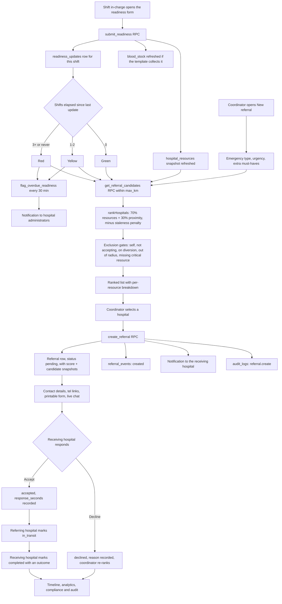

# FERN — Application Specification

This document answers the fourteen specification points named in the FERN engagement contract, one
section per point, in order. It describes **what the delivered build does**, not what a future
version might do. Where something was deliberately left out of this release it is stated plainly in
the relevant section and again in section 8.

| | |
| --- | --- |
| System | FERN — Hospital Emergency Readiness & Inter-Hospital Referral System |
| Release | 1.0.0 |
| Companion documents | [SECURITY.md](SECURITY.md), [DEPLOYMENT.md](DEPLOYMENT.md), [ACCEPTANCE_TESTS.md](ACCEPTANCE_TESTS.md), [API.md](API.md), [DATA_MODEL.md](DATA_MODEL.md) |

---

## 1. Required features

### 1.1 Hospital shift readiness updates

Every hospital is divided into **departments**. Each department is created from one of twelve
**templates**, and the template decides which resource fields that department is responsible for
reporting each shift. This is why an ICU form asks about ventilators and a radiology form does not.

| Template | Label | Resources it reports | Extras |
| --- | --- | --- | --- |
| `emergency` | Emergency / Casualty | general beds, isolation beds, ambulances, power backup, oxygen | controls the hospital-wide ER open / on-diversion flag |
| `theatre` | Main Theatre | operating rooms, resident surgeon, anaesthetist | |
| `icu` | Intensive Care Unit | ICU beds, ventilators, oxygen, dialysis | |
| `nicu` | Neonatal Intensive Care | NICU cots, neonatal resuscitation, oxygen | |
| `maternity` | Maternity / Obstetrics | obstetric theatre, neonatal resuscitation, anaesthetist | |
| `surgery` | Surgery | resident surgeon, neurosurgery, operating rooms | |
| `radiology` | Radiology / Imaging | CT, MRI, X-ray, ultrasound | |
| `blood_bank` | Blood Bank | blood bank functional | also collects per-group unit counts |
| `renal` | Renal / Dialysis | dialysis | |
| `cardiology` | Cardiology | cath lab | |
| `burns` | Burns Unit | burns unit, isolation beds | |
| `general` | General Ward | general beds, oxygen | |

The day is divided into three eight-hour shifts, expressed in **the hospital's own timezone**:

| Shift | Window (local) |
| --- | --- |
| Morning | 07:00 – 15:00 |
| Afternoon | 15:00 – 23:00 |
| Night | 23:00 – 07:00 (attributed to the calendar date on which it started) |

One submission per department per shift is expected. Submitting again within the same shift
corrects the existing record rather than creating a second one — the `readiness_updates` table has
a unique constraint on `(department_id, shift_date, shift_type)` and `submit_readiness()` upserts
onto it.

### 1.2 The traffic light

Status is a function of **shift boundaries elapsed** since the department's most recent submission,
not of wall-clock hours. Counting boundaries is what makes "the night shift did not hand over"
detectable regardless of when in the shift anybody looks.

| Shifts elapsed | Status | Meaning shown to the user |
| --- | --- | --- |
| 0 | 🟢 **Green** — *Current* | Updated for the current shift |
| 1 – 2 | 🟡 **Yellow** — *Overdue* | Not updated in the last shift |
| ≥ 3, or never | 🔴 **Red** — *Stale* | Not updated in the last three shifts |

Thresholds live in `src/domain/readiness.ts` as `YELLOW_THRESHOLD = 1` and `RED_THRESHOLD = 3`.

A **hospital's** status is the worst status among its departments that are flagged
`requires_shift_update`. A hospital with no such departments configured is reported red, not green,
so that a setup gap is visible rather than silently passing. Colour is never the only signal: every
traffic light in the UI is paired with its text label and a `StatusDot` with an accessible name.

### 1.3 Automatic alerts

The `flag_overdue_readiness()` function is scheduled to run every 30 minutes. It finds every active
department that owes an update, computes how many shifts it is behind, and inserts a
`readiness_overdue` notification addressed to each `hospital_admin` (and `super_admin`) responsible
for that hospital, at `warning` severity for yellow and `critical` for red. It de-duplicates, so a
department that stays red does not generate a notification every half hour. It returns the number
of notifications created.

### 1.4 Referral decision support

A referral coordinator opens **New referral**, chooses the emergency type and urgency, ticks any
additional must-have resources, enters an age band, sex and a clinical summary, and is shown a
ranked list of candidate hospitals. Each candidate card shows the percentage score, the resource
and proximity sub-scores, the distance and estimated transport time, the readiness light, the
penalty applied, and a per-resource breakdown of what was and was not available. Ineligible
hospitals are still listed — with the reason they were excluded — because a coordinator needs to
know *why* the nearest trauma centre was skipped.

### 1.5 Confirmation, communication and transfer

Selecting a hospital creates the referral in `pending`, notifies the receiving hospital, records a
timeline event and writes an audit row. The referral detail page shows both hospitals' switchboard
and emergency numbers as `tel:` links, a **Print referral form** action that renders an A4 request
form outside the app chrome, and a real-time chat thread between the two facilities. The receiving
hospital accepts or declines; once accepted the referring hospital marks the patient in transit and
then completed, with an outcome.

### 1.6 Logging and analysis

Every referral carries an immutable `referral_events` timeline and a `score_snapshot` /
`candidate_snapshot` pair recording exactly how the ranking was computed at the moment of the
decision — so a case can be re-explained months later even though readiness data has long since
moved on. Reports aggregate these into acceptance rates, response times and compliance.

---

## 2. User roles

Five roles ship in this build. `super_admin` and `viewer` are additions to the three named in the
project plan: the first so the system can be administered across hospitals without granting clinical
rights, the second so managers and observers can be given dashboards without any ability to act.

| Role | Key | Intended holder |
| --- | --- | --- |
| System Administrator | `super_admin` | The organisation running the network. Full cross-hospital access |
| Hospital Administrator | `hospital_admin` | Runs one hospital: departments, staff, compliance, reports |
| Shift In-Charge | `shift_in_charge` | Files the departmental readiness update each shift |
| Referral Coordinator | `referral_coordinator` | Raises referrals and answers incoming ones |
| Viewer | `viewer` | Read-only dashboards and reports for their hospital |

### 2.1 Capability matrix

Capabilities are declared once in `ROLE_CAPABILITIES` (`src/lib/constants.ts`) and mirrored in the
database by `public.has_capability(text)` (`0002_rls.sql`). The UI matrix gates *affordances*; the
database is the boundary that actually holds.

| Capability | super_admin | hospital_admin | shift_in_charge | referral_coordinator | viewer |
| --- | :---: | :---: | :---: | :---: | :---: |
| `readiness:view` — see readiness boards | ✅ | ✅ | ✅ | ✅ | ✅ |
| `readiness:submit` — file a shift update | ✅ | ✅ | ✅ | — | — |
| `referral:view` — see referrals for their hospital | ✅ | ✅ | ✅ | ✅ | ✅ |
| `referral:create` — raise a referral | ✅ | ✅ | — | ✅ | — |
| `referral:respond` — accept / decline / progress | ✅ | ✅ | — | ✅ | — |
| `messaging:use` — post in a referral thread | ✅ | ✅ | ✅ | ✅ | — |
| `reports:view` — reports for their hospital | ✅ | ✅ | — | ✅ | ✅ |
| `reports:view_all` — reports across all hospitals | ✅ | — | — | — | — |
| `admin:hospital` — hospital, departments, staff | ✅ | ✅ | — | — | — |
| `admin:system` — emergency catalogue, scoring config | ✅ | — | — | — | — |
| `audit:view` — read the audit log | ✅ | ✅ | — | — | — |

### 2.2 Scope, not just capability

Every capability except `reports:view_all` and `admin:system` is additionally scoped to the user's
own hospital by RLS. A `hospital_admin` at Hospital A holds `admin:hospital`, but the policies on
`departments`, `profiles`, `hospital_resources` and `blood_stock` all require
`hospital_id = current_user_hospital()`, so that capability simply does not reach Hospital B's rows.
Referral rows are visible only where the user's hospital is the requesting or the receiving party.

Two guarantees are worth calling out because they are enforced structurally rather than by
convention:

- **Nobody can promote themselves.** `profiles` may be updated by the owner, but a `BEFORE UPDATE`
  trigger (`guard_profile_privileges`) rejects any change to `role`, `hospital_id` or `is_active`
  unless the caller is a `super_admin`, or a `hospital_admin` moving a user within their own
  hospital to a non-super-admin role. A `WITH CHECK` clause cannot see the old row, so this check
  has to be a trigger.
- **Deactivated accounts are locked out immediately.** `current_user_role()` and
  `current_user_hospital()` both filter on `is_active`, so a deactivated user's live JWT resolves to
  no role and no hospital; every scoped policy then fails closed. The client also signs them out on
  next profile load.

---

## 3. Referral workflows

### 3.1 End-to-end flow



### 3.2 Referral state machine

`update_referral_status()` is the only writer, and it rejects any transition not in this table with
SQLSTATE `22023`.

| From | To | Who may do it |
| --- | --- | --- |
| `pending` | `accepted` | Receiving hospital (`referral:respond`) |
| `pending` | `declined` | Receiving hospital (`referral:respond`) |
| `pending` | `cancelled` | Requesting hospital |
| `pending` | `expired` | System |
| `accepted` | `in_transit` | Either party |
| `accepted` | `cancelled` | Either party |
| `accepted` | `completed` | Receiving hospital |
| `in_transit` | `completed` | Receiving hospital |
| `in_transit` | `cancelled` | Either party |
| `declined`, `completed`, `cancelled`, `expired` | — | Terminal. No transitions out |

Side effects performed inside the same transaction as the status change: the matching timestamp
column (`accepted_at`, `in_transit_at`, `completed_at`, `cancelled_at`), `responded_by`,
`responded_at` and `response_seconds` on the first response, a `referral_events` row, a notification
to the counterpart hospital, and an `audit_logs` entry.

### 3.3 Messaging

The chat thread on a referral is open only while the referral is `pending`, `accepted` or
`in_transit`; the RLS `WITH CHECK` on `messages` enforces that. A closed referral is a record, not a
conversation. Only the two participating hospitals (and a `super_admin`) can read a thread.

---

## 4. Referral calculation logic

The whole calculation lives in `src/domain/scoring.ts`. It is a pure function: the same candidates,
requirements, configuration and clock always produce the same ranking, which is what makes it
unit-testable and what makes the stored snapshot a faithful record.

### 4.1 The formula

```
score = clamp( ( resourceScore × resourceWeight + proximityScore × proximityWeight )
               × (1 − penaltyRate), 0, 100 )
```

with the shipped defaults (`DEFAULT_SCORING_CONFIG`, overridable per deployment in the
`scoring_config` table):

| Parameter | Default | Meaning |
| --- | --- | --- |
| `resourceWeight` | `0.70` | Weight on the resource sub-score |
| `proximityWeight` | `0.30` | Weight on the proximity sub-score |
| `yellowPenalty` | `0.15` | −15% of the weighted score when readiness is yellow |
| `redPenalty` | `0.35` | −35% when readiness is red |
| `maxEtaMinutes` | `180` | ETA at which proximity scores zero |
| `maxDistanceKm` | `250` | Straight-line radius; beyond it a hospital is excluded |
| `roadDistanceFactor` | `1.30` | Great-circle km × this ≈ road km |
| `fixedTransportOverheadMinutes` | `10` | Dispatch and handover added to every ETA |
| `tieBreakEpsilon` | `0.50` | Scores within this many points count as tied |
| `excludeRedHospitals` | `false` | When true, red hospitals are excluded outright |
| `excludeHospitalsOnDiversion` | `true` | A hospital with `er_open = false` is never recommended |

### 4.2 Resource sub-score

The emergency type supplies a list of requirements, each with a `weight` (0–10), an `is_critical`
flag and a `min_quantity`. Any resource the coordinator ticks by hand is merged in as **critical**
with a weight of at least 2 and a minimum of at least 1. If an emergency type has no requirements
configured at all, a fallback of *general bed (w3) + oxygen ≥20% (w2) + power backup (w1)* is used,
so a misconfigured catalogue degrades to "can this place take a patient at all?" rather than scoring
every hospital identically at zero.

Each requirement is normalised to an availability in `[0, 1]`:

| Resource kind | Normalisation | Example |
| --- | --- | --- |
| `boolean` | `true → 1`, `false → 0` | Resident surgeon on site |
| `percent` | `value / 100`, clamped | Oxygen at 80% → `0.80` |
| `count` | `value / saturation`, clamped, where `saturation = max(1, resource default, requirement minimum)` | ICU beds (default saturation 2): 1 free → `0.50`, 4 free → `1.00` |

Counts **saturate** deliberately. Two free ICU beds is "available"; twenty is not ten times more
available for the purposes of placing one patient, and without saturation the biggest hospital would
always win regardless of fit.

```
resourceScore = ( Σ availabilityᵢ × weightᵢ ) / ( Σ weightᵢ ) × 100
```

### 4.3 Proximity sub-score

```
roadKm       = straightLineKm × roadDistanceFactor
etaMinutes   = fixedTransportOverheadMinutes + (roadKm / speed(urgency)) × 60
proximity    = clamp(1 − etaMinutes / maxEtaMinutes, 0, 1) × 100
```

Assumed average road speeds are urgency-dependent, because a critical transfer runs blue-light:

| Urgency | Assumed speed |
| --- | --- |
| Critical — immediate | 60 km/h |
| Urgent — within hours | 50 km/h |
| Routine — planned | 40 km/h |

Distance is a great-circle (haversine) distance computed in Postgres by
`get_referral_candidates()`, inflated by the road factor. FERN deliberately carries no routing-API
dependency: the target deployments are frequently on poor connectivity, and an inflated straight
line is accurate enough to *rank* candidates. The factor and the speeds are configuration, so a
deployment can tune them against observed transfer times.

### 4.4 Staleness penalty

A candidate's readiness is the worst-of roll-up across its departments, taken from
`oldest_department_update_at`; if the hospital has no departments configured, the `hospital_resources`
row's own timestamp is used instead. A hospital that has departments *some of which have never
reported* is forced to red regardless of the oldest timestamp — a partial picture is not a fresh one.

| Readiness | Penalty rate | Effect on a weighted score of 80 |
| --- | --- | --- |
| Green | 0.00 | 80.0 |
| Yellow | 0.15 | 68.0 |
| Red | 0.35 | 52.0 |

The penalty is multiplicative, applied after weighting. The number of points removed is reported to
the user as `penaltyApplied` so the deduction is visible, not implied.

### 4.5 Exclusion gates

A candidate accumulates exclusion reasons; any one of them makes it **ineligible**. Ineligible
hospitals are still scored and still shown, always sorted below every eligible option, and are never
auto-selected.

| Gate | Trigger |
| --- | --- |
| Referring facility | The candidate is the origin hospital |
| Not accepting referrals | `accepts_referrals = false` |
| On diversion | `er_open = false` and `excludeHospitalsOnDiversion` is on. The diversion reason is shown |
| Readiness data stale | Readiness is red and `excludeRedHospitals` is on (off by default) |
| Beyond search radius | Straight-line distance > `maxDistanceKm` |
| Missing a critical resource | Any requirement with `is_critical = true` whose `min_quantity` is not met — e.g. "No resident surgeon on site" |

### 4.6 Ordering and tie-break

`compareCandidates` applies, in order:

1. Eligible before ineligible.
2. Higher score — but only if the difference exceeds `tieBreakEpsilon` (0.5 points).
3. **Higher historical acceptance rate** (`referrals_accepted / referrals_received`); a hospital with
   history outranks one with none.
4. Faster historical average response time.
5. Closer.
6. Name, so the order is stable across renders.

### 4.7 Worked example

**Case.** Road-traffic trauma, urgency *critical*, raised from Hospital X. Emergency type
requirements: operating room (w3, critical, min 1), resident surgeon (w3, critical, min 1), blood
bank (w2, critical, min 1), CT scan (w2, min 1), ICU bed (w2, min 1), oxygen (w1, min 30%).
Total weight = 13. Configuration is the shipped default.

**Candidate A — Teaching Hospital, 68 km, readiness yellow**

| Requirement | Reported | Availability | × weight |
| --- | --- | --- | --- |
| Operating room | 3 functional | 1.00 | 3.00 |
| Resident surgeon | yes | 1.00 | 3.00 |
| Blood bank | yes | 1.00 | 2.00 |
| CT scan | yes | 1.00 | 2.00 |
| ICU bed | 4 free (saturation 2) | 1.00 | 2.00 |
| Oxygen | 95% | 0.95 | 0.95 |
| | | **Σ** | **12.95** |

- `resourceScore = 12.95 / 13 × 100 = 99.6`
- `roadKm = 68 × 1.3 = 88.4` → `eta = 10 + (88.4 / 60) × 60 = 98.4 min`
- `proximity = (1 − 98.4/180) × 100 = 45.3`
- `weighted = 99.6 × 0.7 + 45.3 × 0.3 = 69.73 + 13.60 = 83.3`
- yellow → `score = 83.3 × (1 − 0.15) = ` **70.8**, penalty shown as 12.5 points

**Candidate B — Regional Hospital, 32 km, readiness green**

| Requirement | Reported | Availability | × weight |
| --- | --- | --- | --- |
| Operating room | 2 functional | 1.00 | 3.00 |
| Resident surgeon | yes | 1.00 | 3.00 |
| Blood bank | yes | 1.00 | 2.00 |
| CT scan | yes | 1.00 | 2.00 |
| ICU bed | 1 free (saturation 2) | 0.50 | 1.00 |
| Oxygen | 80% | 0.80 | 0.80 |
| | | **Σ** | **11.80** |

- `resourceScore = 11.80 / 13 × 100 = 90.8`
- `roadKm = 32 × 1.3 = 41.6` → `eta = 10 + 41.6 = 51.6 min`
- `proximity = (1 − 51.6/180) × 100 = 71.3`
- `weighted = 90.8 × 0.7 + 71.3 × 0.3 = 63.54 + 21.40 = 84.9`
- green → no penalty → `score =` **84.9**

**Candidate C — District Hospital, 12 km, readiness green, no resident surgeon**

| Requirement | Reported | Availability | × weight |
| --- | --- | --- | --- |
| Operating room | 1 functional | 1.00 | 3.00 |
| Resident surgeon | **no** | 0.00 | 0.00 |
| Blood bank | yes | 1.00 | 2.00 |
| CT scan | no | 0.00 | 0.00 |
| ICU bed | 0 free | 0.00 | 0.00 |
| Oxygen | 60% | 0.60 | 0.60 |
| | | **Σ** | **5.60** |

- `resourceScore = 5.60 / 13 × 100 = 43.1`; `eta = 10 + 15.6 = 25.6 min` → `proximity = 85.8`
- `weighted = 43.1 × 0.7 + 85.8 × 0.3 = 30.15 + 25.73 = 55.9`
- **Ineligible**: "No resident surgeon on site" is a critical requirement that is not met.

**Result**

| Rank | Hospital | Score | Eligible | Why |
| --- | --- | --- | --- | --- |
| 1 | Regional Hospital | **84.9** | ✅ | Good resource fit and half the travel time of the teaching hospital |
| 2 | Teaching Hospital | 70.8 | ✅ | Best resources, but 98 minutes away and 12.5 points lost to stale readiness |
| 3 | District Hospital | 55.9 | ❌ | Nearest by far, but cannot operate — no resident surgeon |

**Tie-break illustration.** Had a fourth hospital D scored 84.6, the gap to B (84.9) would be
0.3 points, within the 0.5-point epsilon, so the two would be treated as tied. If D had accepted
23 of 25 referrals (0.92) and B 17 of 24 (0.71), **D would rank first** on historical success rate,
exactly as the project plan requires.

### 4.8 Why the snapshot matters

At the moment of creation, `create_referral()` stores `score_snapshot` (the configuration, the
normalised requirements and the full breakdown for the selected hospital) and `candidate_snapshot`
(the top ten alternatives with their scores and exclusion reasons). Readiness data changes every
eight hours; the snapshot means a clinical governance review six months later can still see exactly
what the coordinator saw.

---

## 5. Database requirements

Postgres, hosted by Supabase. Fifteen tables plus one view and one internal counter table. Full
column-level detail is in [DATA_MODEL.md](DATA_MODEL.md).

| Table | Purpose |
| --- | --- |
| `hospitals` | The facility register: name, code, level, address, coordinates, phone numbers, timezone, whether it is active and whether it accepts referrals |
| `departments` | Units within a hospital, each bound to a template that decides which resources it reports; `requires_shift_update` marks the ones that owe an update |
| `profiles` | One row per authenticated user: name, email, role, hospital, department, active flag, last login. Created automatically by a trigger on `auth.users` |
| `hospital_resources` | One live snapshot row per hospital holding all 22 resource values plus the ER open / diversion flag. This is what the ranking engine reads |
| `blood_stock` | Units held per hospital per blood group |
| `readiness_updates` | The append-only shift log — one row per department per shift, with the submitted payload. This is what the traffic light and compliance reporting are computed from |
| `emergency_types` | The catalogue of emergency presentations, with a default urgency |
| `emergency_requirements` | Per emergency type, which resources matter, how much they are weighted, whether they are critical and the minimum quantity |
| `referrals` | The referral itself: both hospitals, emergency type, urgency, status, the anonymous patient reference / age band / sex / clinical summary, required resources, both snapshots, distance, ETA, every lifecycle timestamp and the outcome |
| `referral_events` | Immutable per-referral timeline — who changed what, when, from which status to which |
| `messages` | Chat between the two hospitals on a referral |
| `message_receipts` | Per-user read receipts for those messages |
| `notifications` | Per-user in-app alerts with type, severity, link and read state |
| `audit_logs` | Append-only security and activity trail: actor, role, hospital, action, entity, JSON details |
| `scoring_config` | A single row holding the tunable weights, penalties, radius and tie-break epsilon |
| `department_readiness` *(view)* | The freshest submission per active department, ordered by the shift it describes rather than by when it was typed in, so a late correction to an old shift cannot masquerade as current state. Declared `security_invoker` so it is filtered by the caller's own policies |
| `referral_reference_counters` | Internal. Serialises the daily `FERN-YYYYMMDD-NNNN` counter under a row lock so concurrent referrals never collide. No client role has any access |

Structural guarantees enforced in the schema itself:

- Every enumerated column carries a `CHECK` constraint whose members match the literal unions in
  `src/lib/constants.ts` exactly.
- Capacity constraints: available never exceeds total for theatres, ICU, NICU, ventilators and
  general beds; oxygen is bounded to 0–100.
- `referrals_not_self` — a hospital cannot refer to itself.
- `clinical_summary` is capped at 1000 characters.
- `required_resources` must be a subset of the known resource keys.
- Row-level security is enabled on **every** table, and default privileges are revoked before
  explicit grants are issued, so a missing policy can never be papered over by a lingering grant.

---

## 6. Security requirements

Covered in full in [SECURITY.md](SECURITY.md). In summary, the contract's named measures map onto
the build as follows:

| Contract measure | Where it is implemented |
| --- | --- |
| Secure authentication | Supabase Auth (GoTrue) with the PKCE flow; password and email one-time-code sign-in; password reset by emailed link; automatic token refresh; public signup disabled |
| Access controls | Five roles, an eleven-capability matrix in the UI, and Postgres row-level security on every table as the real boundary, with `SECURITY DEFINER` helpers to avoid policy recursion |
| Password protection | Passwords are never stored by the application; GoTrue holds bcrypt hashes. Minimum length and leaked-password protection are configured in the Supabase dashboard; `must_change_password` forces a rotation after an admin-issued credential |
| Encryption | TLS 1.2+ in transit everywhere (HSTS with a two-year max-age and preload); AES-256 at rest on Supabase's managed storage and backups |
| Secure coding | TypeScript strict with no `any`, zod validation on every form, parameterised access through PostgREST and `$1`-style RPC arguments (no string-built SQL), React's default escaping with no `dangerouslySetInnerHTML` anywhere, a CSV formula-injection guard, and a security header set in `vercel.json` |
| Backups | Supabase automated daily backups plus point-in-time recovery; restore drill documented in DEPLOYMENT.md |
| Vulnerability management | `npm audit` in CI on every push, weekly grouped Dependabot PRs, monthly GitHub Actions bumps |
| Logging and monitoring | `audit_logs` records logins, readiness submissions, every referral transition, admin changes and report exports, with actor, role, hospital and JSON detail |
| Credential handling | Only the anon key reaches the browser; the service-role key is never placed in a `VITE_*` variable, never committed and never used by the client |

---

## 7. Reporting requirements

Three report families, all served by Postgres functions so the aggregation happens next to the data.

### 7.1 Referral analytics — `referral_analytics()`

Returns a single JSON object matching the `ReferralAnalytics` type:

| Field | Content |
| --- | --- |
| `total` | Referrals in the window |
| `by_status` | Count per status |
| `by_urgency` | Count per urgency |
| `by_emergency_type` | Count per emergency type, with code and name |
| `acceptance_rate` | Accepted ÷ responded, as a percentage |
| `avg_response_seconds`, `median_response_seconds` | Time from request to first response. The median is reported alongside the mean because one three-hour outlier badly distorts a small sample |
| `avg_completion_minutes` | Request to completion |
| `daily` | Per-day series of created / accepted / completed, for the trend chart |
| `top_receiving`, `top_referring` | Busiest hospitals in each direction |

### 7.2 Hospital performance — `hospital_performance()`

One row per hospital: referrals sent, received, accepted, declined and completed; acceptance rate;
average response seconds; average completion minutes; and readiness compliance rate. This is the
table a network manager uses to see which facility is slow to answer.

### 7.3 Readiness compliance — `compliance_report()`

One row per department over a rolling window (default 7 days): expected updates
(`days × 3` shifts), actual updates, compliance rate, missed shifts and the last submission time.
This is the direct answer to "hospital compliance with readiness updates".

### 7.4 Delivery in the UI

The Reports page presents these as stat tiles, recharts line and bar charts, and sortable tables,
filtered by hospital (a `super_admin` may pick any; everyone else sees their own) and by date range.
Every table exports to CSV through `toCsv` / `downloadCsv`, and each export writes a `report.export`
audit row. CSV cells beginning `=`, `+`, `-` or `@` are prefixed with an apostrophe so a spreadsheet
cannot be induced to execute them.

**Not in this release:** scheduled email delivery of reports and PDF report generation. Reports are
viewed in-app and exported as CSV.

---

## 8. Integrations

Integrations that **are** part of this build:

| Integration | How |
| --- | --- |
| Supabase Auth | Email/password and email OTP; password reset links |
| Supabase Realtime | Postgres change streams drive the chat thread, the notification bell and the referral list |
| Transactional email | Sent by Supabase Auth for OTP codes, invitations and password resets. Templates are configured in the dashboard; a production deployment should point Supabase at its own SMTP provider rather than relying on the built-in rate-limited sender |
| Telephony hand-off | `tel:` links on hospital switchboard and emergency numbers, so a coordinator taps to call from a phone. FERN does not place the call itself |
| Printing | The referral request form is a dedicated print-styled route rendered by the browser's own print dialogue — no PDF service in the loop |

### Not in this release

These are named here so there is no ambiguity about scope:

- **Push notifications and SMS.** Alerts are in-app (the notification centre and its unread badge)
  plus the emails Supabase Auth sends. There is no web-push service worker, no FCM/APNs
  registration and no SMS gateway.
- **Biometric login.** Sign-in is password or emailed one-time code. There is no WebAuthn,
  fingerprint or face unlock. Nothing in the schema precludes adding WebAuthn later.
- **HIS / EMR integration.** FERN does not read from or write to any hospital information system or
  electronic medical record. This is a deliberate consequence of the no-PHI design: there is no
  patient identifier with which to correlate records. Clinical detail reaches FERN only as the
  free-text summary a coordinator types.
- **Mapping and live routing.** Distances are haversine estimates inflated by a configurable road
  factor. There is no Google Maps / Mapbox / OSRM dependency and no live traffic.
- **Ambulance dispatch or GPS tracking.** Ambulance *counts* are reported as a resource; vehicles
  are not tracked.
- **Offline mode.** The app requires connectivity. It degrades gracefully — clear error states and
  retry actions — but does not queue submissions for later.
- **Native mobile applications.** Delivery is a responsive web application (section 9).

---

## 9. Web and mobile requirements

FERN is a **responsive web application**, built mobile-first. A shift in-charge filing an update at
02:00 is holding a phone; an administrator reviewing compliance is at a desktop. Both are the same
build.

| Requirement | Delivery |
| --- | --- |
| Browsers | Current Chrome, Edge, Firefox and Safari (last two major versions), on desktop, tablet and mobile |
| Layout | Tailwind's mobile-first breakpoints throughout. Single-column below `sm`, progressive multi-column above. Tables that cannot collapse scroll horizontally inside their own container rather than breaking the page |
| Touch | Interactive targets are at least 44 px on the shortest axis; the readiness form uses steppers and toggles rather than fiddly number spinners |
| Dark mode | Every surface carries `dark:` variants and follows the OS setting |
| Accessibility | Every input is labelled through the `Field` component, which wires `id`, `aria-describedby`, hint and error text together. Icon-only buttons carry `aria-label`. Traffic-light state is always given as text as well as colour. Focus rings are preserved. Modals trap focus and close on Escape |
| Offline behaviour | Not supported; see section 8 |
| Native apps | Not in scope. The site is installable as a normal browser shortcut but ships no service worker |
| Printing | The referral form route renders outside the app chrome with print styles sized for A4 |

---

## 10. Hosting requirements

| Component | Host | Notes |
| --- | --- | --- |
| Web application | **Vercel** | Static SPA built by `npm run build` into `dist/`, served from Vercel's global edge CDN. SPA rewrites send all non-`/api` paths to `index.html`. Immutable one-year caching on `/assets/*` (content-hashed filenames), no caching of `index.html` |
| Database, auth, realtime | **Supabase** | Managed Postgres with PostgREST, GoTrue and Realtime. Choose the region closest to the hospitals — for a Ghanaian deployment, `eu-west-1` or `eu-west-2` gives the lowest round trip |
| CI | **GitHub Actions** | Typecheck, unit tests, production build and `npm audit` on every push and pull request to `main` |
| DNS and TLS | Vercel-managed | Automatic certificate issue and renewal; HSTS `max-age=63072000; includeSubDomains; preload` |

Both platforms are used at their managed tiers. There is no VM, container or custom server to
patch. A production deployment should sit on Supabase's Pro plan or higher, because point-in-time
recovery and a longer backup retention are only available there (section 11).

Security headers applied to every response by `vercel.json`: `X-Content-Type-Options: nosniff`,
`X-Frame-Options: DENY`, `Referrer-Policy: strict-origin-when-cross-origin`, a `Permissions-Policy`
denying camera, microphone and payment, `Strict-Transport-Security`, and
`Cross-Origin-Opener-Policy: same-origin`.

---

## 11. Backup requirements

| Aspect | Position |
| --- | --- |
| What is backed up | The entire Postgres database — every table listed in section 5, plus the `auth` schema holding user accounts |
| Mechanism | Supabase automated backups. Daily physical backups on all paid plans; **point-in-time recovery (PITR)** with a two-minute recovery point objective on Pro and above |
| Retention | 7 days on Pro by default, configurable up to 28 days. The client should set retention to at least 14 days |
| Recovery point objective | ≤ 2 minutes with PITR enabled; ≤ 24 hours on daily backups alone |
| Recovery time objective | ≤ 1 hour for a full project restore, dominated by Supabase's restore time rather than by anything FERN does |
| Off-platform copy | A weekly `pg_dump` to storage the client controls, so a restore is possible even if the Supabase account itself is lost. Command and schedule in [DEPLOYMENT.md](DEPLOYMENT.md) |
| Application code | Git. The deployed artefact is reproducible from any commit, and Vercel keeps every previous deployment for instant rollback |
| Configuration | The migrations in `supabase/migrations/` are the schema of record. Environment variables are held in Vercel and documented in `.env.example` |
| Testing | The restore procedure must be exercised at least once before go-live and at least once every six months thereafter. Acceptance test **AT-56** covers the first of these |

Restore, rollback and the off-platform dump are all documented step by step in
[DEPLOYMENT.md](DEPLOYMENT.md).

---

## 12. Acceptance tests

The full suite is [ACCEPTANCE_TESTS.md](ACCEPTANCE_TESTS.md): 64 numbered manual test cases, each
with preconditions, steps and an expected result, grouped into fourteen areas — authentication and
session, role gating and capabilities, readiness submission, traffic-light transitions, referral
ranking, referral lifecycle, messaging, overdue alerts, RLS and data isolation, the printable form,
reports and compliance, backup and restore, performance, and mobile/responsive/accessibility checks.
It ends with a defect log, a waiver table and a sign-off block for the client and the developer.

The single most important case is **AT-45**: signed in as Hospital A, Hospital B's referrals must be
unreadable — not merely hidden in the UI, but absent from a direct API response.

Automated coverage complements this: the Vitest suite exercises the pure domain modules
(`src/domain/**`) — shift arithmetic across timezone and midnight boundaries, the green/yellow/red
thresholds, distance and ETA maths, and the ranking engine including saturation, the penalty, the
exclusion gates and the tie-break. CI runs the suite, a typecheck and a production build on every
push.

---

## 13. Performance requirements

### 13.1 Targets

| Metric | Target | How it is achieved |
| --- | --- | --- |
| First contentful paint, 4G mobile | < 1.5 s | Static SPA on a CDN; the initial route is small |
| Time to interactive, 4G mobile | < 3.0 s | Every route is `React.lazy` code-split, and the vendor bundle is split into three manual chunks (`react`, `supabase`, `charts`) so the 400 KB charting library is never downloaded by a shift in-charge who only files readiness |
| Readiness board load | < 1.0 s | One query against the `department_readiness` view; the lateral join is backed by `readiness_updates (department_id, shift_date desc)` and the traffic-light derivation is pure client-side arithmetic on rows already in hand |
| Candidate ranking, 50 hospitals | < 2.0 s end to end | Distance filtering happens in Postgres inside `get_referral_candidates()`; the client receives at most the hospitals inside the radius and ranks them in a single O(n log n) pass |
| Referral list, 500 rows | < 1.5 s | Indexed on `(receiving_hospital_id, status)`, `(requesting_hospital_id, status)` and `requested_at desc`; the list is bounded by an explicit limit and a date filter |
| Sidebar and bell badges | Negligible | Both are `head: true, count: 'exact'` queries — they return a count header and **zero rows**, and poll every 30 seconds only while the tab is focused |
| Chat message delivery | < 1 s | Realtime `postgres_changes` on `messages` filtered to one referral, capped at 5 events/second |
| Report generation, 12 months | < 3.0 s | Aggregation runs in Postgres; the client receives finished rows, never raw referrals |

### 13.2 What makes those numbers hold

**Indexes.** Every filter and sort the application actually issues has an index behind it — the
composite `(receiving_hospital_id, status)` and `(requesting_hospital_id, status)` pairs for the
inbox and outbox, `requested_at desc` for the default ordering, `(department_id, shift_date desc)`
for the readiness lateral join, `(user_id, is_read)` for the unread badge,
`(referral_id, created_at)` for both the chat thread and the timeline, and `(latitude, longitude)`
so candidate search can bound a box before evaluating haversine. The full list with a rationale per
index is in [DATA_MODEL.md](DATA_MODEL.md).

**Aggregation at the source.** Analytics, performance and compliance are Postgres functions. The
browser never downloads a year of referrals to count them.

**Chunked, lazily-loaded bundle.** `vite.config.ts` splits vendor code into `react`, `supabase` and
`charts`; `App.tsx` lazy-loads every page. Assets are content-hashed and served with a one-year
immutable cache.

**Query caching and deduplication.** TanStack Query holds results with per-query stale times
(15 minutes for the scoring configuration, which almost never changes; seconds for live referral
data) and deduplicates concurrent identical requests. Mutations invalidate by namespace through the
central `queryKeys` registry, so a readiness submission refreshes the department light, the hospital
roll-up and the resource snapshot in one pass without a blanket cache flush.

**Counting without fetching.** The two badges that are mounted on every screen — pending referrals
and unread notifications — never pull rows.

**Bounded payloads.** Referral list queries select an explicit column set with named foreign-key
joins rather than `select('*')` across relations; the clinical summary is capped at 1000 characters
and a chat message at 4000.

---

## 14. Final delivery requirements

The delivered artefact set:

| # | Artefact | Location |
| --- | --- | --- |
| 1 | Full application source code | This repository, `src/` |
| 2 | Database schema, security policies, functions and seed data as ordered SQL migrations | `supabase/migrations/` |
| 3 | Automated unit-test suite and CI pipeline | `tests/`, `.github/workflows/ci.yml` |
| 4 | Technical documentation and quickstart | `README.md` |
| 5 | Application specification (this document) | `docs/SPECIFICATION.md` |
| 6 | Cybersecurity measures | `docs/SECURITY.md` |
| 7 | Deployment, backup, restore and rollback runbook | `docs/DEPLOYMENT.md` |
| 8 | Acceptance test suite with sign-off block | `docs/ACCEPTANCE_TESTS.md` |
| 9 | API reference — every RPC, endpoint and realtime channel | `docs/API.md` |
| 10 | Data model — every column, the ER diagram, indexes and retention | `docs/DATA_MODEL.md` |
| 11 | Environment variable template | `.env.example` |
| 12 | Hosting configuration | `vercel.json`, `vite.config.ts` |
| 13 | A running deployment on the client's Supabase and Vercel accounts | Per DEPLOYMENT.md |
| 14 | Handover: administrator walkthrough, the first `super_admin` account, and the signed acceptance test record | Delivered at go-live |

**Handover conditions.** The Supabase and Vercel projects are created under the client's own
accounts, or ownership is transferred to them at handover, so that no credential held by the
developer is required to operate the system. The client holds the database password and the
service-role key; the developer retains neither after sign-off.

**Definition of done.** All 64 acceptance tests pass or carry a written, client-accepted waiver; CI
is green on `main`; the production deployment serves over HTTPS with the documented security
headers; automated backups and point-in-time recovery are enabled and a restore has been
demonstrated; the overdue-readiness job is scheduled and has been observed to fire; and the sign-off
block in ACCEPTANCE_TESTS.md is signed by both parties.
